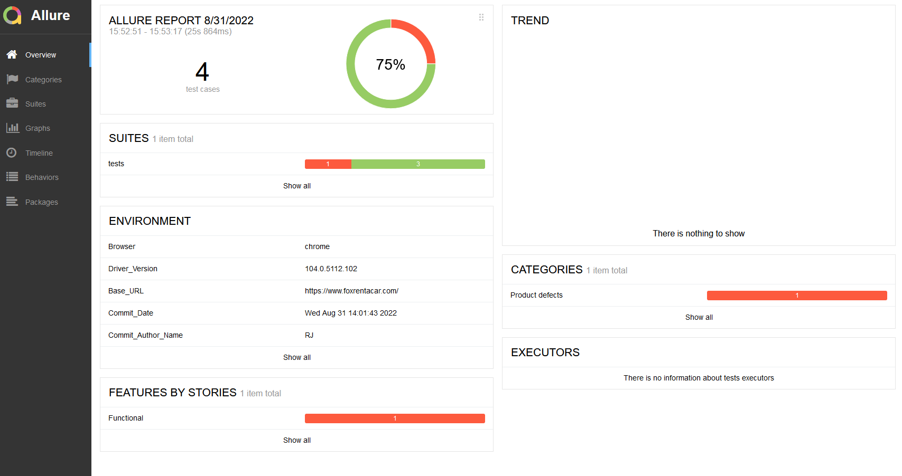

# Python + Selenium based UI Automation Project
A Selenium based UI Automation project in Python using pytest, [Webdriver Manager](https://pypi.org/project/webdriver-manager/) and [allure](https://github.com/allure-framework/allure-python).

### Requirements:
- [Python 3.10](http://python.org/downloads)
- [Poetry](http://python-poetry.org/docs)

Requirements & virtual environments for this project are installed via _poetry_. 
To install poetry run in a terminal window run `python -m pip install poetry --user`

To install project requirements (as defined in _pyproject.toml_ & _poetry.lock_) via poetry in the root of this project run 
```
poetry install
``` 

OR

If using a modern IDE like [PyCharm](https://www.jetbrains.com/pycharm/download/) or [VS Code](https://code.visualstudio.com/Download), open the project and you should get suggestions to install any required plugins
for poetry (VS Code only, it's built into PyCharm) and it should then setup the interpreter for the project automagically.

### Running this Project:
1. Activate the poetry shell for the project: 
```commandline
cd fox
poetry shell
pytest --alluredir=allure-results

```

### Reporting
Test reports are generated using allure.

#### One time setup is as follows
Install scoop via [scoop.sh](http://www.scoop.sh/) and then install allure via scoop

```commandline
scoop install allure
```

#### To generate and view the reports 
Run the following in the root of the project `allure serve allure-results`

This should automatically launch the test report for the latest test run in your default browser.



#### Coding Standards
During development, the code is run through black & pylint and pylint recommendations are implemented where it makes sense.
Additionally, the code is also run through flake8 during the Github Actions run.

### Setup & Project layout

* `/configs` - Contains configuration values for target website and user logins
* `/data ` - Contains expected labels & error messages for various validations
* `/globals` - Values used throughout the project are specified here.
* `/pages` - Page objects that represent each page (or page-like) entity are represented here, along with any page specific helper functions.
* `/tests` - Tests grouped by page/functionality inside these directories and are picked up and executed by pytest 

----

#### Resources & Acknowledgements:
This project is based on the excellent [Selenium Python Example](https://github.com/nirtal85/Selenium-Python-Example) project 

-x-